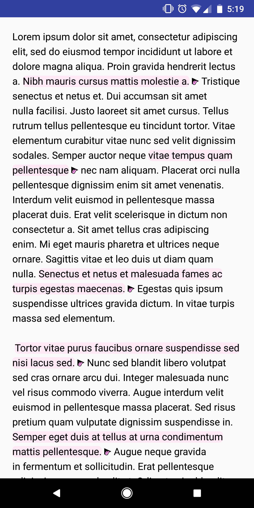
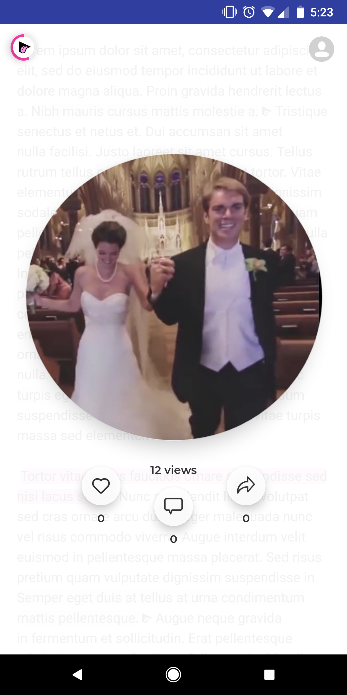

<div align="center">

</div>

## Summary

The Vidy SDK is an Android library that injects Vidy's into an Android Application.

## Prerequisites
* Android SDK v21

#### Permissions
The Vidy SDK requires the Internet permission. Add the following line to your `AndroidManifest.xml` file.
```
<uses-permission android:name="android.permission.INTERNET" />
```
#### Gradle
Include the following repositories in your `build.gradle` file.
```
repositories {
    maven { url "https://dl.bintray.com/vidycoin/maven" }
    maven { url "https://oss.sonatype.org/content/repositories/snapshots" }
}
```
Include the Vidy SDK.
```
implementation 'com.vidy.sdk:vidysdk:0.1.4'
```

Note that updates to the VidySdk will frequently introduce breaking changes until it stabilizes at a `1.0` release version.  When integrating, be sure your Gradle statement specifies an exact version number.

## Steps to use

### 1. Initialize App Id
Set the Application ID in a custom `Application`, `Activity`, or `Fragment`. This only needs to be called one time.
```
VidySdk.setApplicationId("APPLICATION_ID");
```

### 2. Embed Vidy's search
The Vidy SDK can be integrated into an `Activity`, `Fragment`, `ViewGroup`, or `TextView`.  Each activation will load and embed Vidy annotations for a single post registered on our publisher dashboard; the content of the post can be distributed across multiple `TextViews`, which will be discovered in a traversal of the provided content view (e.g. the `Activity`'s root view, the `ViewGroup` provided, etc.)

##### Activity
```
@Override
protected void onCreate(Bundle savedInstanceState) {
    super.onCreate(savedInstanceState);
    setContentView(R.layout.activity_layout);
    VidySdk.activate(this, "POST_ID");
}
```

##### Fragment
```
@Override
public View onCreateView(LayoutInflater inflater, ViewGroup container,
                         Bundle savedInstanceState) {
    view = inflater.inflate(R.layout.fragment_layout, container, false);
    VidySdk.activate(this, view, "POST_ID");
    return view;
}
```

##### ViewGroup
```
@Override
protected void onCreate(Bundle savedInstanceState) {
    super.onCreate(savedInstanceState);
    setContentView(R.layout.activity_layout);
    ViewGroup viewGroup = (ViewGroup)activity.findViewById(android.R.id.content);
    VidySdk.activate(this, viewGroup, "POST_ID");
}
```

##### TextView
```
@Override
protected void onCreate(Bundle savedInstanceState) {
    super.onCreate(savedInstanceState);
    setContentView(R.layout.activity_layout);
    TextView textView = findViewById(R.id.textView);
    VidySdk.activate(this, textView, "POST_ID");
}
```

#### Post ID Scraping
Rather than specify the Post ID explicitly, the VidySdk can infer it by reading the contents of the associated TextViews.  Although this approach also supports posts distributed across multiple TextViews in a complicated layout, the TextViews comprising the post must be specified directly to ensure their scraped content is properly ordered.

##### Single TextView
When a single TextView is provided without a Post ID, its content is read and matched against your existing posts.
```
@Override
protected void onCreate(Bundle savedInstanceState) {
    super.onCreate(savedInstanceState);
    setContentView(R.layout.activity_layout);
    TextView textView = findViewById(R.id.textView);
    VidySdk.activate(this, textView);
}
```

##### Distributed across multiple TextViews
When multiple TextViews are provided, their content is read in the order given and the view hierarchy is not traversed (no additional TextViews will be discovered and annotated).
```
@Override
protected void onCreate(Bundle savedInstanceState) {
    super.onCreate(savedInstanceState);
    setContentView(R.layout.activity_layout);
    List<TextView> textViews = new ArrayList<TextView>();
    textViews.add((TextView) findViewById(R.id.title_textView));
    textViews.add((TextView) findViewById(R.id.summary_textView));
    textViews.add((TextView) findViewById(R.id.content_textView));
    ViewGroup containingLayout = findViewById(R.id.containingLayout);
    VidySdk.activate(this, containingLayout, textViews);
}
```


### 3. Manually update UI
The SDK requires inflation and changes that occur on the UI thread. This can be manually controlled by adding two parameters to the function. Set `updateViews` to false and provide a `VidyCallback` to notify when the UI is ready to load.
```
VidySdk.activate(Activity activity, String postId, boolean updateViews, VidyCallback vidyCallback)
```
```
@Override
protected void onCreate(Bundle savedInstanceState) {
	super.onCreate(savedInstanceState);
	setContentView(R.layout.activity_fullscreen);

	VidySdk.setApplicationId(this, "bd6e3c14-57ad-4d26-b7f2-b92a4c750c19");
	vidyPost = VidySdk.activate(this, "samplepost", false, new VidyCallback() {
		@Override
		public void onSuccess(VidyPost vidyPost, VidyState vidyState) {
			if(vidyState == VidyState.UPDATE_READY && isUiReadyToUpdateViews()) {
				vidyPost.updateViews();
			}

		}

		@Override
		public void onFailure(VidyError vidyError) {

		}
	});
}

protected boolean isUiReadyToUpdateViews() {
  // Configure based on the rest of your view layout.
  // e.g., Ensure the user is not currently interacting with a ScrollView.
}
```
```
protected void onUiReadyToUpdateViews() {
  // Manually perform the Vidy view update in case your UI was not ready
  // to update when the callback method was invoked.
  if (vidyPost.getState == VidyState.UPDATE_READY) {
    vidyPost.updateViews();
  }
}
```
## Output

| Before | After | On Press |
:-------------------------:|:-------------------------:|:-------------------------:
||


| On Completion | Social | Login |
:-------------------------:|:-------------------------:|:-------------------------:
||
